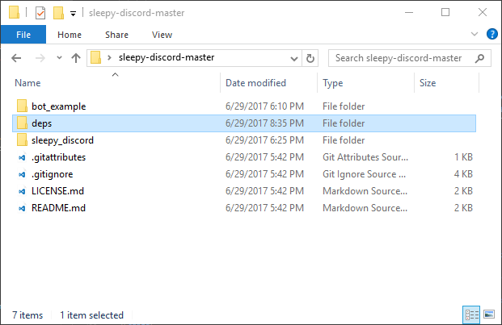
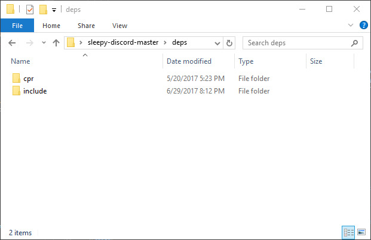
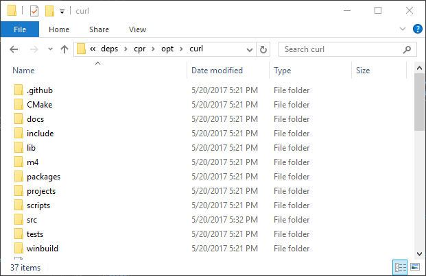

[⮌ Go back to documentation](documentation.html)

#How to Compile
<aside class="notice">
The first step to using Sleepy Discord
</aside>

##Requirements

- Visual Studio (recommended)
- Python 3.6.3 (optional - setup script)

##Downloading Sleepy Discord

[Just click here to download.](https://github.com/NoNamer64/sleepy-discord/zipball/master)

Then unzip it by extracting the files out of the zip file.

##Automated setting up libraries
```powershell
PS C:\> python -v
Python 3.6.3 (v3.6.3:2c5fed8, Oct  3 2017, 17:26:49) [MSC v.1900 32 bit (Intel)] on win32
>>> quit()
```
Make sure you have Python 3.6.3, by using ``python -V``.

```powershell
PS C:\sleepy-discord-master\> .\setup.py
What OS are you building Sleepy Discord for?
0 - Windows
1 - Linux
2 - macOS
> 0
What libraries do you want to use?
0 - CPR
1 - Websocket++
2 - uWebSockets
> 0 1
```
Run the script ``setup.py`` by double clicking the py file, or call ``.\setup.py`` in the command line. Then just follow the instructions on screen. Once that's done go to [Compiling Sleepy Discord](#compiling-sleepy-discord).

##Manual setting up libraries
###Downloading CPR
<aside class="notice">
You may skip this step, if you are planning on using your own http library
</aside>
The CPR library can be found here [https://github.com/whoshuu/cpr](https://github.com/whoshuu/cpr). Once downloaded, in the sleepy-discord folder, make a new folder called deps (short for dependencies). Inside the deps, place the cpr-master folder in there, and rename it to cpr. Open the cpr folder, and take the include folder, and place it inside deps.
<pre>


</pre>

And in the cpr folder, open the opt folder. You should see an empty folder named curl. You will need to place curl there. Go here [https://github.com/whoshuu/cpr/tree/master/opt](https://github.com/whoshuu/cpr/tree/master/opt) and click on curl and download curl. Open the zip file and curl folder, and then drag everything in that folder into the curl folder that's inside the opt folder. And just build curl. If on windows, just open the buildconf.bat file.
<pre>

</pre>

###Downloading the Websocket Library
<aside class="notice">
You may skip this step, if you are planning on using other websocket libraries
</aside>

* [Websocket++](#websocketpp)
* [uWebSockets](#uwebsockets)

###Websocketpp
You can find the Websocket++ library here [https://github.com/zaphoyd/websocketpp](https://github.com/zaphoyd/websocketpp). Once downloaded, open the zip file, and the websocketpp-master folder, and extract the websocketpp folder to the deps\include folder.
<pre>

</pre>

You are also going to need the Asio library, that can be found here [http://think-async.com/Asio/Download](http://think-async.com/Asio/Download). Open the zip file, and asio folder, and include folder. Extract the asio folder, and asio.hpp file to your deps\include folder.
<aside class="notice">
Sleepy Discord uses version 1.10.8, and does not work with 1.10.6. [The latest version can be downloaded here](https://sourceforge.net/projects/asio/files/latest/download)
</aside>

Last, you are also going to need openSSL. There's two options:

1. Download precompiled openSSL: [wiki.openssl.org](https://wiki.openssl.org/index.php/Binaries) or [npcglib.org](https://www.npcglib.org/~stathis/blog/precompiled-openssl/). You will be needing 7-zip, WinRAR or other program which one is able to unzip .7z files.

2. Or download it from [https://www.openssl.org/](https://www.openssl.org/). Once downloaded, extract the folder inside to somewhere to work on it. To install look at the instructions in INSTALL because this has its own set of instructions including downloading and installing some other dependencies. 

Once one of those two options are done, move all the .h files in openssl\include\openssl into deps\include\openssl. You'll also need to place lib folder into deps, you'll need this to link Sleepy Discord. 
<pre>

</pre>

##Compiling Sleepy Discord
<u>
There's only two options:
</u>

* [Visual Studio](#visual-studio)
* [Make](#make)

###Visual Studio
Open the sleepy_discord folder and find the sleepy_discord.vcxproj file. Open sleepy_discord.vcxproj with Visual Studio, of course. At the top, there a toolbar, click build and then build sleepy_discord. And you're done.

<aside>
For now, compiling for x64 doesn't work just yet.
</aside>
<aside class="success">
If you were able to compile the library, but can't find it, look up at the toolbar, click Project and then Properties.<br>
Go to Configuration Properties -> General -> Output Directory<br>
click on Output Directory, and then click on the drop down arrow and click edit. In the 2nd textbox it'll tell you were it compile it to.
Then do the same thing for the Target Name to get the name of the file.
</aside>
<aside class="success">
Don't forget to change the configuration to ``Release`` if you don't want the debug version.
</aside>

###Make
```shell
cd buildtools/
make -f Makefile.linux
```
Call those commands in your shell, and you're done. It should compile a file called libsleepy_discord.a.

##The Next Step
Now that you have a compiled Sleepy Discord, head over to [How to Link](link.html) to link it to a new or existing project.
