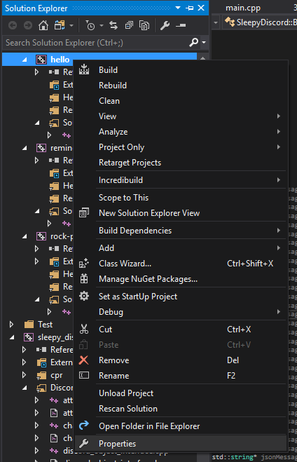
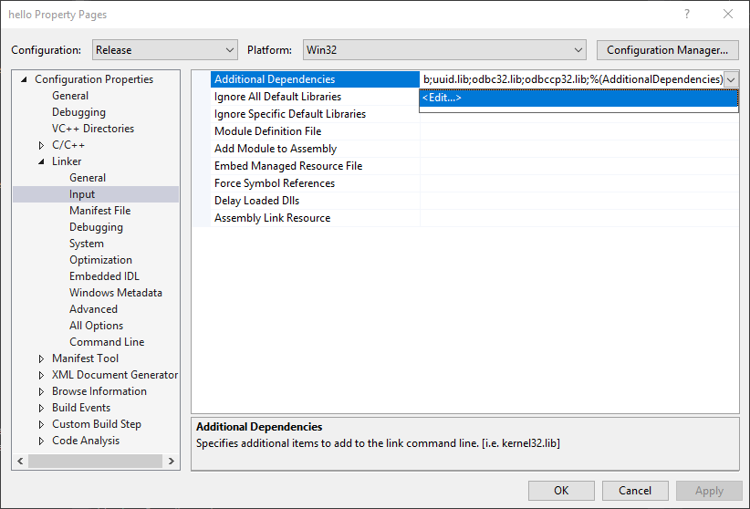

[⮌ Go back to documentation](documentation.html)

#How To Link

<aside class="notice">
I'm going to assume that you have compiled Sleepy Discord or aquired a compiled binary
</aside>

#Visual Studio
<aside class="notice">
For now, Visual Studio is the only option.
</aside>

**Preparing:** Before we start, if are using a library that needs curl, for example cpr, then you need to compile it.

> Here what the commands should look like for compiling curl

```shell
"C:\Program Files (x86)\Microsoft Visual Studio\2017\Community\VC\Auxiliary\Build\vcvars32.bat"
cd ..\..\sleepy-discord\deps\cpr\opt\curl\winbuild
nmake /f Makefile.vc mode=static VC=14
```

Here's a good guide to do just that, but before you read it remember to change things like ``Microsoft Visual Studio 12.0`` or ``VC=12`` or ``vc12`` to ``Microsoft Visual Studio 14.0`` or ``VC=14`` or ``vc14`` or whatever version of Visual Studio. [Anyway, here is the guide that I'm talking about.](https://stackoverflow.com/a/32168255) After you have compiled curl, place the include and lib folders into deps.

**Step 1:** First you need a project, of course. Go make a new one if you haven't done so already.

**Step 2:** Right click on your project in the Solution Explorer and go to Properties.



<aside class="notice">
Alt+F7 also works if you have only one project in your solution.
</aside>
**Step 3:** On the left, go to VC++ Directories. Click on Include Directories and then click on the arrow on the right, and then click ``Edit...``


**Step 4:** Click on the white empty box at the top, and then click on the 3 dots on the right.

> The box of Include Directories should look something like this, but with the full path

```bash
$(projectdir)..\include
$(projectdir)..\deps
$(projectdir)..\deps\include
$(projectdir)..\include\sleepy_discord\IncludeNonexistent
```

**Step 5:** Select the folder containing the folder ``sleepy_discord``, and do the same for the dependencies(``deps``), include dependencies (``deps/include``), and the ``\include\sleepy_discord\IncludeNonexistent``. Also, it is important to note that the order of these folders matter. The compiler will look at the first path first, and and the 2nd one next, so ``\include\sleepy_discord\IncludeNonexistent`` needs to be last. This is so that we don't get "any include files not found" errors. Anyway, once done, click OK. These folders will be the folders that Visual C++ will look into to find header files for Sleepy_Discord.

> The box of Library Directories should look like this, but with full paths

```bash
$(projectdir)$(Configuration)
$(projectdir)..\deps\lib
```

**Step 6:** Do the same thing for Library Directories, add the folder with Sleepy_Discord and all it's needed libraries. This tells Visual C++ to search for library files in these folders

**Step 7:** To tell Visual C++ to link these library, click on the arrow to the left of Linker, and go to Input. Click on Additional Dependencies, and then click on the arrow on the right, and then click Edit...



> Here's a good example of the library files to list

```bash
sleepy_discord.lib
libcurl_a.lib
libcryptoMT.lib
libsslMT.lib
crypt32.lib
```

**Step 8:** On the text box at the top add ``sleepy_discord.lib`` then add all the other needed library files you also need. The librarys you will need to link to will depend on your deps/lib folder, system, platform, and configuration. Also, each library file is separated by a new line. Once you're done, remember to click OK.

**(optional) Step 9:** Click the arrow to the left of C/C++, and go to Preprocessor. Click on Preprocessor Definitions, and then click Edit...

**(optional) Step 10:** On the text box at the top add whatever preprocessor definitions, you need. You don't need any to link Sleepy Discord. This is here just in case, you need it.

##Now, It's Time to Compile

> Here's some example code for you to compile

```cpp
/*If you are using uWebSockets,
  remember to change this to uwebsockets_websocket.h*/
#include "sleepy_discord/websocketpp_websocket.h"

class myClientClass : public SleepyDiscord::DiscordClient {
public:
	using SleepyDiscord::DiscordClient::DiscordClient;
	void onMessage(SleepyDiscord::Message message) {
		if (message.startsWith("whcg hello"))
			sendMessage(message.channelID, "Hello " + message.author.username);
	}
};

int main() {
	myClientClass client("token", 2);
	client.run();
}
```

And now you should be able to build without any errors. If you did get an error, then check that you followed the instructions correctly. And, if you are still getting errors, post an issue on the github repository.
